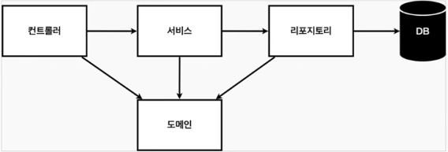
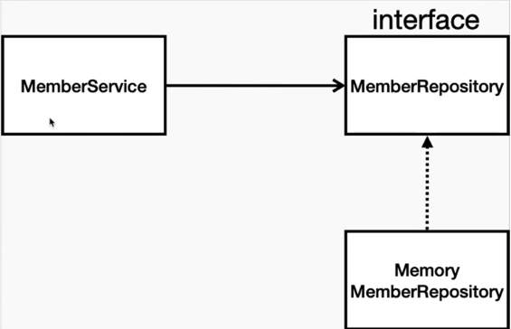

# 비즈니스 요구사항

 가장 쉽고 단순한 예제
* 데이터: 회원 ID, 회원 이름
* 기능: 회원 등록, 조회
* 아직 데이터 저장소(DB)는 선정되지 않은 상태(가상 시나리오)

## 웹 애플리케이션 계층 구조

* 컨트롤러: 웹 MVC 컨트롤러
* 서비스: 핵심 비즈니스 로직
* 리포지토리: DB 접근, 도메인 객체의 DB 저장 및 관리
* 도메인: 비즈니스 도메인 객체(*예: 회원, 주문, 쿠폰 등*). 주로 DB에 저장하고 관리됨

## 클래스 의존관계

* `MemberService`: 회원 비즈니스 로직
* `MemberRepository`: DB 리포지토리
  * 인터페이스로 구현 클래스를 변경할 수 있도록 설계
  * 개발 초기 단계에서는 가벼운 메모리 기반 데이터저장소 사용
