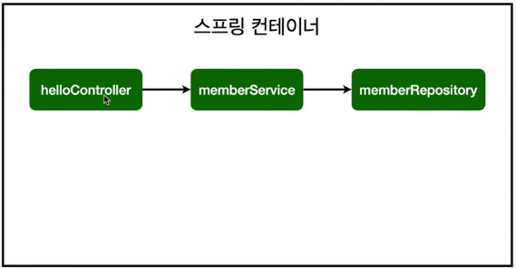
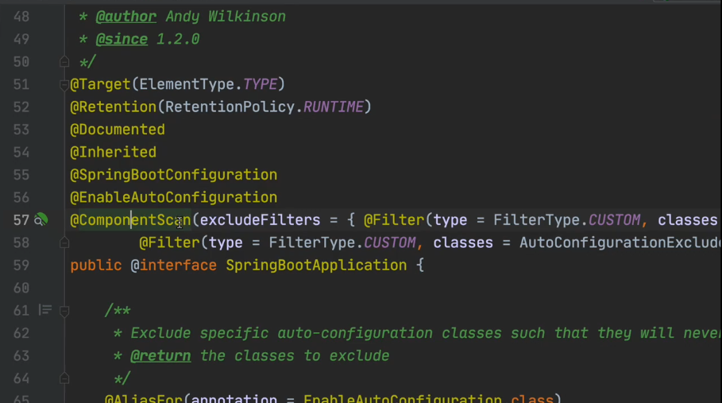

# 스프링 빈과 의존관계



스프링 컨테이너는 스프링 빈을 만들고 관리한다.
* 스프링 빈 객체 생성
* 스프링 빈 간 의존관계 설정


회원 서비스를 통해 회원가입하고, 회원 서비스는 회원 리포지토리를 통해 회원을 조회한다. 이와 같이 객체 간 의존 관계를 설정한다.

> [MVC, 템플릿 엔진](../web-basic/01_web_basic.md)에서처럼, 스프링 부트 서버가 작동하면 스프링 컨테이너가 뜨고, `@Controller` 등 애노테이션이 붙은 스프링 빈을 찾아서 관리한다.


 스프링 빈을 만들고 의존 관계를 설정하는 데에는 두 가지 방법이 있다.

* [컴포넌트 스캔과 자동 의존관계 설정](02_component_scan.md)
* [자바 코드로 직접 스프링 빈 등록](03_java_spring_bean.md)
> 스프링은 스프링 컨테이너에 스프링 빈을 등록할 때, 기본으로 싱글톤 방식을 사용한다. 즉, 스프링 컨테이너에서 모든 스프링 빈 인스턴스는 유일하게 하나만 생성되어 공유된다. 따라서 같은 스프링 빈은 모두 같은 인스턴스이다.
> 
> 싱글톤이 아니게 설정할 수 있지만, 대부분 싱글톤으로 사용한다.


## 컴포넌트 스캔과 자동 의존관계 설정

* `@SpringBootApplication` 애노테이션이 붙은 최상위 애플리케이션의 패키지부터 시작해 컴포넌트 스캔
  
* `@Component` 애노테이션이 있으면 객체 생성 후 자동으로 스프링 빈 등록
* `@Component`를 포함하는 다음의 애노테이션도 자동으로 스프링 빈 등록
  * `@Controller`
  * `@Service`
  * `@Repository`

> 애노테이션 안에 포함되어 있는 애노테이션을 찾아 주는 것은 자바 애노테이션 기능이 아니라, 스프링의 기능이다.

## 자바 코드로 직접 스프링 빈 등록

일단 현재 가상의 요구 사항은 데이터 저장소 구현체가 정해지지 않은 상황이기 때문에, 이 방법을 사용한다.

> 실무에서는 주로 정형화된 컨트롤러, 서비스, 리포지토리와 같은 코드는 컴포넌트 스캔을 통해, 정형화되지 않거나 상황에 따라 구현 클래스를 변경해야 할 때는 설정을 통해 스프링 빈으로 등록한다.

## 의존관계 주입 방법

 스프링 빈 의존관계 설정에는 3가지 방법이 있다. 

* **생성자 주입**: 권장
```java
@Controller
public class MemberController {
    
    private MemberService memberService;
    
    @Autowired
    public MemberController(MemberService memberService) {
        this.memberService = memberService;
    }
}
```

* 필드 주입: 권장되는 방식은 아니다. 스프링 뜰 때만 넣어 주고, 중간에 바꿀 수 있는 방법이 없다.

```java
@Controller
public class MemberController {
    
    @Autowired MemberService memberService;
    
}
```

* setter 주입: 권장되는 방식은 아니다. 의존관계를 주입하는 코드가 `public`으로 노출되기 때문에, 중간에 바뀔 수 있다. 처음에 조립할 때만 의존관계가 주입되어야지, 누군가 나중에 바꿀 수 있다는 것은 좋지 않다.

```java
@Controller
public class MemberController {
    
    private MemberService memberService;
    
    @Autowired
    public void setMemberService(MemberService memberService) {
        this.memberService = memberService;
    }
}
```

## 기타
* 보통 빈이 생성된 후 의존관계 주입이 진행되지만, 생성자 주입의 경우, 다만, 빈이 생성될 때 의존관계 주입이 함께 진행된다.
* `@Autowired` 애노테이션은 당연히, 스프링 빈으로 등록된 것에서만 동작한다.
