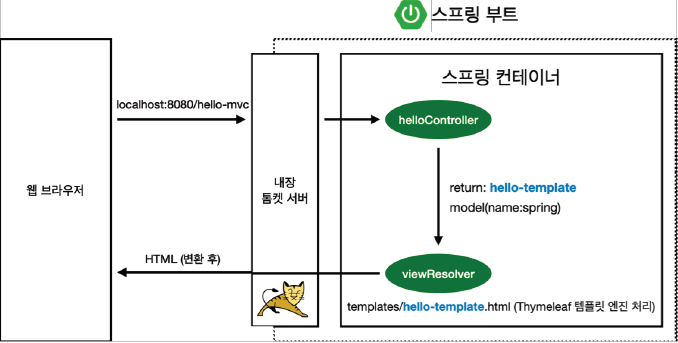

# 스프링 웹 개발 기초

 웹 개발에는 크게 3가지의 방법이 있다.
 
* 정적 컨텐츠: 서버에서 정적 컨텐츠를 그대로 서빙
* MVC와 템플릿 엔진: 서버에서 동적 가공을 후 컨텐츠 서빙
* API: 클라이언트에게 혹은 서버끼리 json, xml 등 데이터를 서빙

## 정적 컨텐츠

스프링부트는 보통 `/static` 폴더에서 정적 컨텐츠를 제공한다.

 정적 컨텐츠 디렉토리에 예제 html 파일을 만들어 보자.
```html
<!DOCTYPE html>
<html lang="en">
<head>
    <title>Static</title>
    <meta http-equiv="Content-Type" content="text/html; charset=UTF-8">
</head>
<body>
정적 컨텐츠
</body>
</html>
```

 실행 후 파일명 그대로, `localhost:8080/hello-static.html`으로 접근한다.

<br>

원리는 다음과 같다.


* 스프링 부트 내장 톰캣 서버가 `hello-static.html`에 대한 요청을 스프링 컨테이너에 위임한다
* 스프링 컨테이너가 컨트롤러에서 `hello-static` 관련 컨트롤러가 있는지 찾는다 → **컨트롤러가 우선순위**
* 스프링 컨테이너가 매핑된 컨트롤러를 찾지 못하면 `resources` 내부의 정적 컨텐츠를 찾는다
* 찾으면 반환한다. 변환하지 않고 그대로 넘긴다

## 템플릿 엔진

 MVC는 모델(Model), 뷰(View), 컨트롤러(Controller)의 약자이다.

 과거에는 컨트롤러와 뷰가 분리되어 있지 않고, 뷰에서 대부분을 처리하는 모델 원 방식을 사용했다. 요즘은 MVC 스타일을 사용한다. **관심사의 분리**, **역할과 책임**의 관점에서 이해하면 된다.
* view: 화면을 그리는 데 집중
* controller, model: 비즈니스 로직 처리에 집중

<br>
 `name` 파라미터를 받아 모델에 넘기도록 컨트롤러 예제를 작성해 보자.
* `name` 파라미터 넘기지 않고 실행하면 `MissingServletRequestParameterException`이 발생하므로, `required = false` 옵션 사용 

```java
@Controller
public class HelloController {
    @GetMapping("hello")
    public String hello(Model model) {
        model.addAttribute("data", "hello"); // 스프링이 직접 받는다
        return "hello"; // hello.html 리턴
    }
    
    @GetMapping("hello-mvc")
    public String helloMvc(@RequestParam("name", required=false) String name, Model model) {
        // url 파라미터로 받은 것을 model에 넘김
        model.addAttribute("name", name);
        return "hello-mvc";
    }
}
```

 `name` 파라미터를 받아 처리할 `hello-mvc.html`을 작성해 보자.
* thymeleaf 템플릿 엔진으로 작성. 템플릿 엔진이 html을 동적으로 바꾸는 역할을 담당
```html
<!DOCTYPE html>
<html xmlns:th="http://www.thymeleaf.org">
<head>
    <title>Hello</title>
    <meta http-equiv="Content-Type" content="text/html; charset=UTF-8" />
</head>
<body>
<p th:text="'안녕하세요. ' + ${name}">Hello! empty</p>
</body>
</html>
```

 실행 후, `name` 쿼리 파라미터를 넘기면 된다.

 원리는 다음과 같다.


* `hello-mvc` 요청이 오면, 톰캣 서버가 요청을 스프링 컨테이너에 넘긴다
* 스프링 컨테이너에서 `hello-mvc`와 매핑된 컨트롤러를 찾는다
* 찾아진 `helloController`는 request parameter를 model에 key(`name`) - value 형태로 넘겨서, 스프링에게 넘긴다
* 스프링의 화면과 관련된 resolver가 템플릿 엔진을 찾아 연결시킨다
* 변환된 HTML이 클라이언트에게 보여진다. 정적 컨텐츠와 달리, 템플릿 엔진에 의해 변환된 화면이 넘어간다


## API
